# 🏗️ DocuSync Architecture Documentation

## 📋 Table of Contents
- [Architecture Overview](#-architecture-overview)
- [Design Principles](#-design-principles)
- [Directory Structure](#-directory-structure)
- [Data Flow Architecture](#-data-flow-architecture)
- [Design Patterns](#-design-patterns)
- [Security Architecture](#-security-architecture)
- [Performance Considerations](#-performance-considerations)
- [Scalability Strategy](#-scalability-strategy)

---

## 🎯 Architecture Overview

DocuSync implements **Clean Architecture** (Hexagonal Architecture) principles, ensuring a maintainable, testable, and scalable enterprise application. This architecture choice provides clear separation of concerns and enables the system to evolve independently of external frameworks and databases.

### Why Clean Architecture?

```
🎯 Business Logic Independence  → Changes in UI/DB don't affect core business rules
🧪 Enhanced Testability        → Easy to unit test business logic in isolation  
🔄 Framework Flexibility       → Can swap out web frameworks, databases, etc.
📈 Long-term Maintainability   → Clear boundaries reduce cognitive complexity
🚀 Team Scalability           → Multiple teams can work on different layers
```

### Architecture Layers


---

## 🎨 Design Principles

### 1. **SOLID Principles Implementation**

#### **Single Responsibility Principle (SRP)**
- Each class has one reason to change
- Services are focused on specific business capabilities
- Repositories handle only data access for specific aggregates

```csharp
// ✅ Good: Single responsibility
public class DocumentService : IDocumentService
{
    // Only handles document-related operations
    public async Task<Result<Document>> CreateDocumentAsync(CreateDocumentRequest request)
    public async Task<Result<Document>> UpdateDocumentAsync(UpdateDocumentRequest request)
}

// ✅ Good: Separate concern
public class ComplianceService : IComplianceService
{
    // Only handles compliance-related operations
    public async Task<ComplianceStatus> CheckComplianceAsync(Guid clientId)
}
```

#### **Open/Closed Principle (OCP)**
- Portal integration uses Strategy Pattern for extensibility
- New portals can be added without modifying existing code

```csharp
public interface IPortalService
{
    Task<Result<IEnumerable<PortalDocument>>> GetDocumentsAsync();
    Task<Result<bool>> TestConnectionAsync();
}

// Can add new portal implementations without changing existing code
public class OrangePortalService : IPortalService { }
public class SharePointPortalService : IPortalService { } // Future addition
```

#### **Liskov Substitution Principle (LSP)**
- All repository implementations are interchangeable
- Interface contracts are honored by all implementations

#### **Interface Segregation Principle (ISP)**
- Focused interfaces prevent fat interface anti-pattern
- Clients depend only on methods they actually use

```csharp
// ✅ Focused interfaces
public interface IDocumentRepository : IRepository<Document>
{
    Task<IEnumerable<Document>> GetByClientIdAsync(Guid clientId);
    Task<IEnumerable<Document>> GetExpiringDocumentsAsync(DateTime threshold);
}

public interface IComplianceRepository : IRepository<Requirement>
{
    Task<IEnumerable<Requirement>> GetActiveRequirementsAsync();
    Task<ComplianceStatus> GetComplianceStatusAsync(Guid clientId);
}
```

#### **Dependency Inversion Principle (DIP)**
- High-level modules don't depend on low-level modules
- Both depend on abstractions (interfaces)

### 2. **Domain-Driven Design (DDD) Patterns**

#### **Aggregates & Aggregate Roots**
```csharp
public class Client : Entity, IAuditableEntity
{
    // Client is an Aggregate Root
    private readonly List<Requirement> _requirements = new();
    public IReadOnlyCollection<Requirement> Requirements => _requirements.AsReadOnly();
    
    // Business invariants enforced within aggregate boundary
    public void AddRequirement(DocumentType documentType, DocumentFrequency frequency)
    {
        // Business rule: No duplicate requirements for same document type
        if (_requirements.Any(r => r.DocumentTypeId == documentType.Id && r.Status == RequirementStatus.Active))
            throw new DomainException("Active requirement already exists for this document type");
            
        var requirement = new Requirement(Id, documentType.Id, frequency);
        _requirements.Add(requirement);
        
        // Domain event for other bounded contexts
        AddDomainEvent(new RequirementAddedDomainEvent(requirement));
    }
}
```

#### **Value Objects**
```csharp
public class PortalCredentials : ValueObject
{
    public string Username { get; private set; }
    public byte[] EncryptedPassword { get; private set; }
    public string PortalType { get; private set; }
    
    // Value objects are immutable and defined by their values
    protected override IEnumerable<object> GetEqualityComponents()
    {
        yield return Username;
        yield return EncryptedPassword;
        yield return PortalType;
    }
}
```

---

## 📁 Directory Structure

```
📁 DocuSync/
├── 📄 README.md                     # Project overview & setup
├── 📄 ARCHITECTURE.md              # This file
├── 📄 DECISIONS.md                 # Technology decisions
├── 📄 .env.example                 # Environment template
├── 📄 DocuSync.sln                 # Solution file
│
├── 📁 src/                         # Source code
│   ├── 📁 DocuSync.Domain/         # 💼 Core Business Logic
│   │   ├── 📁 Entities/            # Domain entities & aggregates
│   │   ├── 📁 ValueObjects/        # Immutable value objects  
│   │   ├── 📁 Services/            # Domain services
│   │   ├── 📁 Events/              # Domain events
│   │   ├── 📁 Repositories/        # Repository interfaces
│   │   └── 📁 Common/              # Shared domain concepts
│   │
│   ├── 📁 DocuSync.Application/    # 🎮 Use Cases & Orchestration
│   │   ├── 📁 Services/            # Application services
│   │   ├── 📁 Models/              # DTOs & view models
│   │   ├── 📁 Authorization/       # Custom auth handlers
│   │   ├── 📁 Common/              # Shared application logic
│   │   └── 📁 Extensions/          # Service registration
│   │
│   ├── 📁 DocuSync.Infrastructure/ # 🔧 External Dependencies
│   │   ├── 📁 Data/                # EF Core, repositories
│   │   ├── 📁 Identity/            # Authentication & authorization
│   │   ├── 📁 Portal/              # External portal integrations
│   │   ├── 📁 Documents/           # File storage (Azure Blob)
│   │   ├── 📁 Migrations/          # Database migrations
│   │   └── 📁 Extensions/          # Service registration
│   │
│   ├── 📁 DocuSync.Web/           # 🌐 User Interface
│   │   ├── 📁 Components/          # Reusable Blazor components
│   │   │   ├── 📁 Admin/           # Admin-specific components
│   │   │   ├── 📁 Layout/          # Layout components
│   │   │   └── 📁 Pages/           # Page components
│   │   ├── 📁 Identity/            # Identity UI customizations
│   │   ├── 📁 wwwroot/             # Static files
│   │   └── 📄 Program.cs           # Application entry point
│   │
│   └── 📁 DocuSync.Functions/      # ⚡ Background Processing
│       ├── 📁 EmailProcessing/     # Email workflow automation
│       ├── 📁 Graph/               # Microsoft Graph integration
│       └── 📁 Configuration/       # Function-specific config
│
├── 📁 tests/                      # Test Projects
│   ├── 📁 DocuSync.Domain.Tests/   # Domain logic tests
│   ├── 📁 DocuSync.Application.Tests/ # Use case tests
│   └── 📁 DocuSync.Infrastructure.Tests/ # Integration tests
│
└── 📁 docs/                       # Additional Documentation
    ├── 📄 deployment-guide.md      # Deployment instructions
    ├── 📄 api-documentation.md     # API documentation
    └── 📁 diagrams/                # Architecture diagrams
```

### **Layer Responsibilities**

| Layer | Responsibility | Dependencies |
|-------|----------------|--------------|
| **Domain** | Business logic, entities, rules | None (Pure business logic) |
| **Application** | Use cases, orchestration, DTOs | Domain only |
| **Infrastructure** | Data access, external services | Domain, Application |
| **Presentation** | UI, controllers, API endpoints | Application, Infrastructure |
| **Functions** | Background processing, jobs | Application, Infrastructure |

---

## 🔄 Data Flow Architecture

### **Command Flow (Write Operations)**

```mermaid
sequenceDiagram
    participant UI as 🌐 Blazor Component
    participant App as 🎮 Application Service
    participant Domain as 💼 Domain Entity
    participant Repo as 🔧 Repository
    participant DB as 🗄️ Database
    
    UI->>App: CreateDocumentAsync(request)
    App->>App: Validate request
    App->>Domain: Create new document
    Domain->>Domain: Apply business rules
    Domain-->>App: Return domain entity
    App->>Repo: SaveAsync(entity)
    Repo->>DB: INSERT document
    DB-->>Repo: Success/Error
    Repo-->>App: Result<Document>
    App-->>UI: Success/Failure response
```


### **Query Flow (Read Operations)**

```mermaid
sequenceDiagram
    participant UI as 🌐 Blazor Component
    participant App as 🎮 Application Service
    participant Repo as 🔧 Repository
    participant Cache as ⚡ Cache Layer
    participant DB as 🗄️ Database
    
    UI->>App: GetDocumentsAsync(clientId)
    App->>Cache: Check cache
    
    alt Cache Hit
        Cache-->>App: Cached data
    else Cache Miss
        App->>Repo: GetByClientIdAsync(clientId)
        Repo->>DB: SELECT documents
        DB-->>Repo: Document data
        Repo-->>App: Domain entities
        App->>Cache: Store in cache
    end
    
    App->>App: Transform to DTOs
    App-->>UI: DocumentListDto[]
```


### **Background Processing Flow**

```mermaid
sequenceDiagram
    participant Timer as ⏰ Azure Function Timer
    participant Queue as 📬 Service Bus Queue
    participant Processor as 🔧 Background Processor
    participant Graph as 📧 Microsoft Graph
    participant DB as 🗄️ Database
    
    Timer->>DB: Check for due notifications
    DB-->>Timer: List of due items
    Timer->>Queue: Enqueue notification jobs
    Queue->>Processor: Dequeue job
    Processor->>Graph: Send email notification
    Graph-->>Processor: Email sent confirmation
    Processor->>DB: Update notification status
```


---

## 🎭 Design Patterns

### 1. **Repository Pattern**
**Purpose**: Encapsulate data access logic and provide a more object-oriented view of the persistence layer.

```csharp
public interface IRepository<T> where T : Entity
{
    Task<T> GetByIdAsync(Guid id, CancellationToken cancellation = default);
    Task<IEnumerable<T>> GetAllAsync(CancellationToken cancellation = default);
    Task AddAsync(T entity, CancellationToken cancellation = default);
    Task UpdateAsync(T entity, CancellationToken cancellation = default);
    Task DeleteAsync(T entity, CancellationToken cancellation = default);
}

// Specific repository with domain-specific queries
public interface IDocumentRepository : IRepository<Document>
{
    Task<IEnumerable<Document>> GetExpiringDocumentsAsync(
        DateTime threshold, 
        CancellationToken cancellation = default);
        
    Task<IEnumerable<Document>> GetByClientIdAsync(
        Guid clientId, 
        CancellationToken cancellation = default);
}
```

**Benefits**:
- Testability through mocking
- Centralized query logic
- Consistent data access patterns
- Easy to swap database implementations

### 2. **Strategy Pattern (Portal Integration)**
**Purpose**: Enable different portal integration strategies without modifying existing code.

```csharp
public interface IPortalService
{
    string PortalType { get; }
    Task<Result<bool>> TestConnectionAsync(CancellationToken cancellation = default);
    Task<Result<IEnumerable<PortalDocument>>> GetDocumentsAsync(CancellationToken cancellation = default);
    Task<Result<Stream>> DownloadDocumentAsync(string documentId, CancellationToken cancellation = default);
}

// Strategy implementations
public class OrangePortalService : IPortalService
{
    public string PortalType => "Orange";
    
    public async Task<Result<bool>> TestConnectionAsync(CancellationToken cancellation = default)
    {
        // Orange-specific connection logic
        // Handles Orange API authentication, rate limiting, error scenarios
        return Result.Success(true);
    }
}

// Portal factory for strategy selection
public class PortalServiceFactory
{
    private readonly IEnumerable<IPortalService> _portalServices;
    
    public IPortalService CreatePortalService(string portalType)
    {
        return _portalServices.FirstOrDefault(p => p.PortalType == portalType)
            ?? throw new NotSupportedException($"Portal type '{portalType}' is not supported");
    }
}
```

### 3. **Result Pattern (Railway-Oriented Programming)**
**Purpose**: Handle success/failure scenarios without exceptions, improving performance and code clarity.

```csharp
public class Result<T>
{
    public bool IsSuccess { get; private set; }
    public bool IsFailure => !IsSuccess;
    public T Value { get; private set; }
    public string Error { get; private set; }
    
    private Result(T value)
    {
        IsSuccess = true;
        Value = value;
    }
    
    private Result(string error)
    {
        IsSuccess = false;
        Error = error;
    }
    
    public static Result<T> Success(T value) => new(value);
    public static Result<T> Failure(string error) => new(error);
}

// Usage in services
public async Task<Result<Document>> CreateDocumentAsync(CreateDocumentRequest request)
{
    // Validation
    if (string.IsNullOrEmpty(request.Title))
        return Result<Document>.Failure("Document title is required");
        
    try
    {
        var document = new Document(request.Title, request.ClientId);
        await _repository.AddAsync(document);
        return Result<Document>.Success(document);
    }
    catch (Exception ex)
    {
        return Result<Document>.Failure($"Failed to create document: {ex.Message}");
    }
}
```

### 4. **Factory Pattern (Entity Creation)**
**Purpose**: Encapsulate complex object creation logic and ensure proper entity initialization.

```csharp
public static class RequirementFactory
{
    public static Requirement CreateComplianceRequirement(
        Guid clientId,
        DocumentType documentType,
        DocumentFrequency frequency,
        DateTime? customDeadline = null)
    {
        var deadline = customDeadline ?? CalculateNextDeadline(frequency);
        
        var requirement = new Requirement(clientId, documentType.Id, frequency)
        {
            NextDeadline = deadline,
            Status = RequirementStatus.Active
        };
        
        // Apply business rules based on document type
        switch (documentType.Category)
        {
            case DocumentCategory.Financial:
                requirement.SetReminderDays(30, 7); // Earlier reminders for financial docs
                break;
            case DocumentCategory.Operational:
                requirement.SetReminderDays(14, 3);
                break;
        }
        
        return requirement;
    }
}
```

### 5. **Observer Pattern (Domain Events)**
**Purpose**: Decouple domain logic from side effects and cross-cutting concerns.

```csharp
public abstract class Entity
{
    private readonly List<IDomainEvent> _domainEvents = new();
    public IReadOnlyCollection<IDomainEvent> DomainEvents => _domainEvents.AsReadOnly();
    
    protected void AddDomainEvent(IDomainEvent domainEvent)
    {
        _domainEvents.Add(domainEvent);
    }
    
    public void ClearDomainEvents()
    {
        _domainEvents.Clear();
    }
}

// Domain event
public class DocumentExpiredDomainEvent : IDomainEvent
{
    public Guid DocumentId { get; }
    public Guid ClientId { get; }
    public DateTime ExpiredAt { get; }
    
    public DocumentExpiredDomainEvent(Guid documentId, Guid clientId, DateTime expiredAt)
    {
        DocumentId = documentId;
        ClientId = clientId;
        ExpiredAt = expiredAt;
    }
}

// Event handler
public class DocumentExpiredEventHandler : INotificationHandler<DocumentExpiredDomainEvent>
{
    private readonly IEmailService _emailService;
    
    public async Task Handle(DocumentExpiredDomainEvent notification, CancellationToken cancellationToken)
    {
        // Send notification email
        // Update compliance status
        // Log audit trail
    }
}
```

---

## 🔐 Security Architecture

### **Multi-Layered Security Approach**


### **Authentication & Authorization Flow**

```csharp
// Custom authorization requirement
public class ClientAccessRequirement : IAuthorizationRequirement
{
    public Guid RequiredClientId { get; }
    
    public ClientAccessRequirement(Guid requiredClientId)
    {
        RequiredClientId = requiredClientId;
    }
}

// Custom authorization handler
public class ClientAccessAuthorizationHandler : AuthorizationHandler<ClientAccessRequirement>
{
    private readonly ICurrentUser _currentUser;
    private readonly IClientRepository _clientRepository;
    
    protected override async Task HandleRequirementAsync(
        AuthorizationHandlerContext context,
        ClientAccessRequirement requirement)
    {
        // Verify user belongs to the client organization
        var userId = _currentUser.UserId;
        var hasAccess = await _clientRepository.UserHasAccessToClientAsync(userId, requirement.RequiredClientId);
        
        if (hasAccess)
        {
            context.Succeed(requirement);
        }
        
        // Audit failed access attempts
        if (!hasAccess)
        {
            // Log security event for monitoring
            _logger.LogWarning("Unauthorized access attempt by user {UserId} to client {ClientId}", 
                userId, requirement.RequiredClientId);
        }
    }
}
```

### **Data Protection Strategy**

```csharp
public class PortalCredentials : ValueObject
{
    public string Username { get; private set; }
    public byte[] EncryptedPassword { get; private set; } // Never store plain text
    public string PortalType { get; private set; }
    
    public PortalCredentials(string username, string password, string portalType, IDataProtector dataProtector)
    {
        Username = username;
        EncryptedPassword = dataProtector.Protect(Encoding.UTF8.GetBytes(password));
        PortalType = portalType;
    }
    
    public string DecryptPassword(IDataProtector dataProtector)
    {
        var decryptedBytes = dataProtector.Unprotect(EncryptedPassword);
        return Encoding.UTF8.GetString(decryptedBytes);
    }
}
```

---

## ⚡ Performance Considerations

### **Database Optimization Strategies**

1. **Efficient Querying with EF Core**
```csharp
public async Task<IEnumerable<Document>> GetClientDocumentsOptimizedAsync(Guid clientId)
{
    return await _context.Documents
        .Where(d => d.ClientId == clientId)
        .Include(d => d.DocumentType) // Only include what's needed
        .Select(d => new DocumentListDto // Project to DTO to reduce data transfer
        {
            Id = d.Id,
            Title = d.Title,
            Status = d.Status,
            TypeName = d.DocumentType.Name,
            LastModified = d.LastModified
        })
        .OrderByDescending(d => d.LastModified)
        .Take(100) // Limit results for pagination
        .AsNoTracking() // Read-only queries don't need change tracking
        .ToListAsync();
}
```

2. **Caching Strategy Implementation**
```csharp
public class CachedDocumentService : IDocumentService
{
    private readonly IDocumentService _documentService;
    private readonly IMemoryCache _cache;
    private readonly TimeSpan _cacheDuration = TimeSpan.FromMinutes(15);
    
    public async Task<IEnumerable<DocumentTypeDto>> GetDocumentTypesAsync()
    {
        const string cacheKey = "document-types";
        
        if (_cache.TryGetValue(cacheKey, out IEnumerable<DocumentTypeDto> cachedTypes))
        {
            return cachedTypes;
        }
        
        var documentTypes = await _documentService.GetDocumentTypesAsync();
        
        _cache.Set(cacheKey, documentTypes, _cacheDuration);
        
        return documentTypes;
    }
}
```

### **Background Processing Optimization**

```csharp
[Function("ProcessExpiredDocuments")]
public async Task ProcessExpiredDocuments(
    [TimerTrigger("0 0 8 * * *")] TimerInfo timer, // Run daily at 8 AM
    [ServiceBusTrigger("expired-documents", Connection = "ServiceBusConnection")] string queueItem)
{
    // Batch processing for efficiency
    const int batchSize = 100;
    var processedCount = 0;
    
    do
    {
        var expiredDocuments = await _documentService
            .GetExpiredDocumentsAsync(DateTime.UtcNow, batchSize);
            
        if (!expiredDocuments.Any())
            break;
            
        // Process in parallel for better performance
        var tasks = expiredDocuments.Select(async doc =>
        {
            await _notificationService.SendExpirationNotificationAsync(doc);
            await _complianceService.UpdateComplianceStatusAsync(doc.ClientId);
        });
        
        await Task.WhenAll(tasks);
        processedCount += expiredDocuments.Count();
        
    } while (processedCount < batchSize);
}
```

---

## 📈 Scalability Strategy

### **Horizontal Scaling Approach**

1. **Stateless Application Design**
   - No server-side state stored in memory
   - Session data stored in distributed cache (Redis)
   - Background processing through Azure Functions

2. **Database Scaling Strategy**
   - Read replicas for query distribution  
   - Connection pooling for efficient resource usage
   - Eventual consistency where appropriate

3. **Caching Layers**
   - L1: In-memory cache for frequently accessed data
   - L2: Distributed Redis cache for shared data
   - L3: CDN for static resources

4. **Asynchronous Processing**
   - Message queues for decoupling operations
   - Event-driven architecture for real-time updates
   - Background jobs for heavy processing

### **Monitoring & Observability**

```csharp
public class DocumentService : IDocumentService
{
    private readonly ILogger<DocumentService> _logger;
    private readonly IMetrics _metrics;
    
    public async Task<Result<Document>> CreateDocumentAsync(CreateDocumentRequest request)
    {
        using var activity = _metrics.StartTimer("document.create.duration");
        
        _logger.LogInformation("Creating document {Title} for client {ClientId}", 
            request.Title, request.ClientId);
            
        try
        {
            // Business logic here
            var result = await CreateDocumentInternalAsync(request);
            
            _metrics.Increment("document.create.success");
            return result;
        }
        catch (Exception ex)
        {
            _metrics.Increment("document.create.failure");
            _logger.LogError(ex, "Failed to create document {Title} for client {ClientId}", 
                request.Title, request.ClientId);
            throw;
        }
    }
}
```

---

## 🔄 Future Architecture Evolution

### **Microservices Migration Path**

1. **Phase 1**: Modular Monolith (Current)
   - Clear bounded contexts within single deployment
   - Separate databases for different domains
   - Event-driven communication between modules

2. **Phase 2**: Service Extraction
   - Extract notification service as first microservice
   - Move portal integration to dedicated service
   - Implement API Gateway for routing

3. **Phase 3**: Full Microservices
   - Separate services for documents, compliance, clients
   - Event sourcing for complex business processes
   - CQRS for read/write optimization

### **Event-Driven Architecture Preparation**

```csharp
public interface IEventBus
{
    Task PublishAsync<T>(T @event, CancellationToken cancellationToken = default) where T : IDomainEvent;
    void Subscribe<T, THandler>() 
        where T : IDomainEvent 
        where THandler : class, IEventHandler<T>;
}

// Domain events ready for distributed processing
public class DocumentExpiredDomainEvent : IDomainEvent
{
    public Guid DocumentId { get; set; }
    public Guid ClientId { get; set; }
    public DateTime ExpiredAt { get; set; }
    public string EventType => "document.expired";
    public DateTime OccurredOn => DateTime.UtcNow;
}
```

---

This architecture documentation demonstrates a deep understanding of enterprise software design principles, patterns, and scalability considerations. The Clean Architecture approach ensures maintainability while the comprehensive security model and performance optimizations show production-ready thinking.